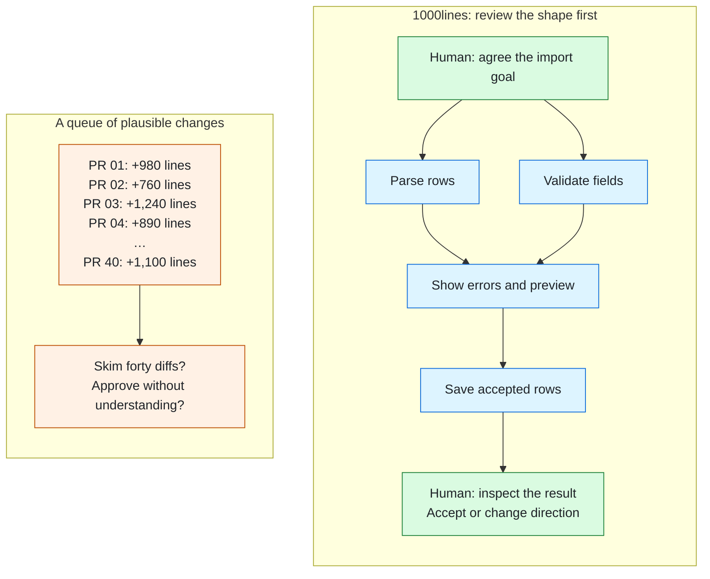

# 1000lines

**Agent speed. Human judgment.**

## What has changed in software development

Agents have made implementation dramatically cheaper. The cost of *deciding what to build* has not fallen with it, and neither has the cost of being accountable for the result.

Many software development practices were shaped around scarce implementation capacity: estimation, scoping, change control, sprint commitment, and the review queue itself. Producing more code shifts the constraint. Human attention becomes the scarce resource: understanding what was wanted, deciding whether what arrived was right, and keeping a record good enough to answer for it later.

An agent can hand you thirty thousand lines in forty pull requests. Each diff can look plausible while the project heads in the wrong direction. If nobody can understand the whole, approval becomes a rubber stamp. Smaller PRs help, but choosing the right forty is a planning problem; recognizing that they were the wrong forty is a replanning problem.

1000lines puts those decisions in front of humans while they are still small enough to understand.

## What your attention goes to

Suppose the goal is to let a customer preview a CSV import, correct invalid rows, and save the accepted data. Compare a queue of changes with a plan you can question before agents start:

*Illustrative. Blue tasks become focused PRs with AI review and human acceptance. Green nodes show goal and outcome decisions; the graph itself is reviewed before execution. Real plans link tasks to their PRs and show progress.*

The aim is to inspect the shape of the work before reading its results. The diffs remain available, and a tidy diagram does not prove correctness. It makes missing work, dependencies, and unnecessary complexity easier to question.

## Why human review still matters

[Martin Monperrus argues that coding agents can take over the traditional functions of code review](https://arxiv.org/abs/2606.13175), and that having humans inspect every change cannot keep pace. We accept much of that argument. Defect detection, style enforcement, and documentation maintenance belong primarily with automation in our workflow. Two human functions remain:

**Responsibility.** Software has consequences. Someone must understand the outcome, the evidence, and the tradeoffs well enough to answer for them. Asking that person to approve an illegible change does not establish meaningful responsibility. Our human reviewer considers the AI reviews and the result; we do not pretend they have inspected every line.

**Requirements and design judgment.** We need agreement about what we are trying to achieve, and permission to change our minds as we learn. Passing tests and an AI review cannot establish that the result is what a person or business actually needs. Goals, tradeoffs, and changes of direction are useful places for human involvement.

## Enough planning to make a decision

Start with a short account of the intended outcome, then a coherent set of tasks and their dependencies. There should be enough detail for a person to question the decomposition, without having to read an implementation in prose.

The specification-first camp is right about the order and wrong about the quantity. We make a first pass with a deliberately low bar, then get going. Writing became cheap; reading still consumes the scarce human attention. Working software also teaches us things that a longer specification will not.

A usable plan therefore needs clear task boundaries, visible dependencies, and a way to record changed decisions. It must be cheap to revise. Planning once and treating every later discovery as an implementation defect would miss the point.

## What 1000lines does

1. **Clarify the goal.** A human's rough description becomes requirements and a design for review, with enough detail to plan from.
2. **Review the shape.** A planner proposes small tasks and their dependency graph. A human reviews that picture before the work fans out into tickets.
3. **Execute and review.** Agents work on tasks whose dependencies are ready. Each produces a focused PR against a base that exists, with AI review findings and a clear human handoff.
4. **Replan when understanding changes.** A human with write access can change the design through PR feedback; agents record the decision and implement it. If the task boundary holds, replace the approach within it. Small boundary changes can add, remove, or split a task, with a ticket where needed. Larger changes create a planning ticket and a fan-out ticket so the revised graph can be reviewed before execution resumes.

The first version concentrates on two mechanisms: a reviewable dependency graph, and a legible trail of decisions and rationales in focused PRs. They help humans exercise judgment, and give both humans and agents a record to consult when something goes wrong. A thousand lines is an ambition for manageable work, not proof that a change is small or sound.

## Why the graph earns its place

The obvious way to use agents at scale is to fan the work out and collect the pull requests. We tried it. The orchestrator coped, ploughing steadily through forty tickets at once, and the correctness was terrible.

It did not fail loudly. Each diff was individually plausible. Tickets that should have been ordered ran in parallel against bases that did not exist yet, each inventing its own version of work that had not landed. Reviewing a change in isolation made the problem hard to see.

**Correctness depends on the plan as well as the diff.** The graph exposes assumptions about dependencies and parallel work, so a reviewer can challenge them. When those assumptions fail, it also helps identify what needs replanning.

## What is running, and what is being built

1000lines is being extracted from the agentic framework used on Orchestra Bio's codebase: planning, human plan review, fan-out into reviewed PRs, and replanning after execution reveals a mistake. The public repositories remove that business context and provide a place to try the approach elsewhere.

- [**symphony**](https://github.com/1000lines/symphony): our fork of [openai/symphony](https://github.com/openai/symphony), Apache 2.0, the orchestrator underneath.
- [**symphony-example**](https://github.com/1000lines/symphony-example): a repository wired for agent work, and a worked example of the planning and review flow.
- **The client template and reusable workflows**: in development for the 12 September hackathon, following the [reviewed implementation plan](https://github.com/1000lines/symphony-example/pull/34). The goal is to onboard an existing repository to the shared Symphony service without requiring its owner to run a server.
