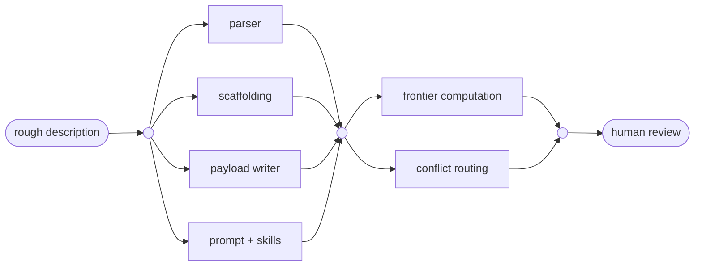

# 1000lines

Code review has been a cornerstone of software engineering for fifty years. There have been significant changes over that time, but agentic development is the first that suggests code review should cease altogether ([Monperrus](https://arxiv.org/pdf/2606.13175)).

We agree. We differ. We concede the vast bulk of the argument, and then part company over what is left. These are the functions of review that we think should continue, and why.

## The functions that survive

**Responsibility.** This requires a human in the loop somewhere. Software matters: very often with large business consequences, and not so infrequently with life-or-death ones. Society still wants humans on the line for such things. So do I. Which means asking a reviewer to sign off has to be different from asking for a rubber stamp, and so the most pressing question about code review, once the rest of the argument is granted, is how to make responsibility meaningful.

**Requirements and design review.** There has always been a focus on reviewing what we are trying to do before we start doing it. The key insight is that these plans do not survive contact with reality, and flexibility in execution is needed. As we see what we are building, we learn, and our ideas change. That does not undermine the need to agree a goal before starting. It is a good place for human involvement.

**Planning supervision.** One of the two foci of this first version of 1000lines. Plans for software development have always involved breaking a design into tasks, each relatively self-contained, with dependencies between them. Drawn as a line in a Gantt chart, these dependencies are in practice a DAG. The key improvements in software engineering have been about making such plans more flexible, most notably Agile. We express plans as mermaid diagrams, which become one of the primary reviewable artifacts, legible to both humans and machines.

**A legible trail of decisions and rationales.** The second and last focus of this first version. Smaller pull requests, perhaps under a thousand lines, are easier to understand than larger ones, particularly when they do one thing. This matters whether the reviewer is a human, an AI, or a human giving a quick eyeball and a stamp. If the PR is not legible, the stamp can only be a rubber stamp; a stamp on a legible document is worth something to the responsibility path. And even in an AI-only workflow, legible records give an escalation path for audit or troubleshooting: a path that is boring and unimportant, until it isn't.

**Semi-formal breaking down of complex decisions into simpler ones.** Useful whether the decisions are reviewed by a person or a machine. This follows from good planning with legible records.

We agree with Monperrus that several traditional functions of review are now better fully automated, because LLMs outperform people at them: defect detection, and style and standards enforcement. In our own human-in-the-loop workflow, an approval means the human has reviewed the AI reviews, not that the human has meaningfully reviewed the code. The traditional role of knowledge transfer is better served by documentation maintenance, where again we would expect LLMs to excel.

That is most of what code review was for. We are not arguing for its preservation out of sentiment.

## What changes for a business

The cost of building software has collapsed. The cost of *deciding what to build* has not, and neither has the cost of being accountable for it afterwards.

For fifty years the scarce resource was implementation capacity. Many SDLC practices were shaped around rationing it: estimation, scoping, change control, sprint commitment, and the review queue itself. When that constraint goes, the practices built to manage it may cease to be useful. They become the wrong shape.

What stays scarce is narrower and higher level: the clarity of what was actually wanted, the capacity to decide whether what arrived was right, and a record good enough to answer for it later. Those are the three things a business is now short of, and none of them are addressed by producing code faster.

1000lines is an attempt to put engineering effort where the scarcity now is.

## What it does

A human writes a rough description of what they want. Those rough notes are turned into a cleaned-up requirements document and, after review, a planner creates a dependency graph of small tickets. **A human reviews the graph**, one picture rather than forty tickets, and approves the shape. Agents then work the graph's frontier, each ticket becoming its own pull request against a base that actually exists. The PRs are reviewed, by AIs and probably by humans. When reality diverges from the plan, the plan is replaced rather than patched.

*Illustrative. Real plans are generated per project and committed to the repository as their own artifact.*

## Requirements and design: how much is enough

The specification-first camp is right about the order and wrong about the quantity. We make a first pass with a deliberately low bar, then get going.

The economics moved unevenly. Writing became almost free; reading costs what it always did, and the human reader is the scarce resource. A long generated specification costs more to read, and it loses the thinking too, because writing was how somebody was forced to think the problem through.

Meanwhile the most useful review of a design has always been working code, and for fifty years it was unaffordable: you could not build the thing merely to find out whether the design was right. Now you can.

So the question is how much documentation up front. Enough to plan from, meaning enough to produce a decomposition that a person can review, rather than enough to determine the implementation.

A plan is not a specification. It is a decomposition with a review gate, revised cheaply and often, with the revisions recorded. This matters beyond guardrails and evals, which evaluate one change at a time: many of the important failures are emergent, and when coding and replanning are both cheap, the answer is to start over.

## Planning supervision: why a graph

The obvious way to use agents at scale is to fan the work out and collect the pull requests. We tried it. The orchestrator coped, ploughing steadily through forty tickets at once, and the correctness was terrible.

It did not fail loudly. Each diff was individually plausible. The defect was in the decomposition: tickets that should have been ordered ran in parallel against bases that did not exist yet, each inventing its own version of work that had not landed. Review does not catch that, because there is nothing wrong with any single change. Neither does a guardrail, for the same reason.

Which is the argument in one line: **correctness lives in the plan, not in the diff.** Review catches bad changes. Only planning catches bad decomposition, and nobody audits the plan.

So the plan is the artifact we ask a person to look at, and a diagram is what makes that a minute's work rather than an afternoon's.

## What we have running, and what is here

The code, and the example code, is taken from the agentic framework we are using on our actual codebase today: planning, human plan review, fan-out into reviewed pull requests, mechanical consequence-tiering computed from the diff, and whole-project replanning to recover from any major execution mistake. What is made available here is a sane extraction, excluding our own business context.

- [**symphony**](https://github.com/1000lines/symphony): our fork of [openai/symphony](https://github.com/openai/symphony), Apache 2.0, the orchestrator underneath.
- **symphony-example**: coming any day, a repository wired for agent work, as a worked example.
- **the template**: to be built during the hackathon on 12 September. One command turns an existing repository into one agents can work in under review.
