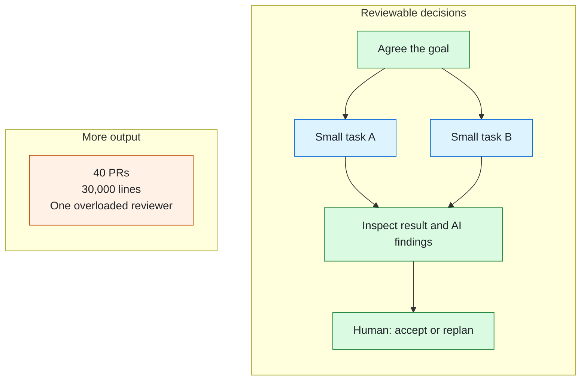

# 1000lines

**Agent speed. Human judgment.**

An agent can hand you thirty thousand lines in forty pull requests. If nobody can
understand the whole, approval becomes a rubber stamp. Producing code got cheaper;
deciding what to build and taking responsibility for it did not.

1000lines turns a rough goal into a reviewable plan, then focused PRs with AI review.
Humans judge the goal, the shape of the work, and its results. When working software
changes our understanding, agents record the decision and replan.

*Illustrative: review the graph before execution, then consider each focused PR and
its AI findings.*

The longer argument, including how much planning is enough and what happens when it
changes: [1000lines](https://github.com/1000lines/.github/blob/main/README.md).

## What's here

- [**symphony**](https://github.com/1000lines/symphony): our fork of
  [openai/symphony](https://github.com/openai/symphony), by way of Orchestra Bio's
  public fork. The orchestrator.
- [**symphony-example**](https://github.com/1000lines/symphony-example): a repository
  wired for agent work, as a worked example from Orchestra Bio.
- **The client template and reusable workflows**: being built for Saturday
  12 September at the [AI Tinkerers hackathon](https://sf.aitinkerers.org/p/agents-everywhere-bots-channels-more-global-hackathon).
  The goal is to connect your repository to the shared service without running your
  own Symphony server.

## If you're at the hackathon

Bring a repo you own. Not code, a repo. You leave with agent workflows running in
your own project, and we find out whether this survives contact with a codebase that
isn't ours.

### What you need

- A GitHub repo you own and whose settings you can change. Public is easiest.
- CI that passes on main. A Docker build is ideal. If it needs secrets, tell me in
  advance; that is a different setup path.
- A merge path that does not require two approvals or a code owner.
- A Linear account. We will add you to the workspace.
- A piece of work you would like to start: a few paragraphs of notes, not a spec.
  Something real you have been putting off.
- Two or three hours in the room. You are the reviewer for your own repo, so the
  loop stops when you walk away.

### What you do not need

No server, no API key, no Elixir install, nothing running on your laptop. Symphony
runs in the cloud. You review pull requests in your own repo, in a browser.

### What happens

Your notes become a plan for you to review. The plan becomes a dependency graph of
tickets. The tickets fan out into small pull requests, each one sized so you can
hold it in your head. You review them, and your feedback drives the next round of
planning.

### As Soon As You Can

Send me the repo URL and whether it has a Docker build. We will get it wired up as
you arrive.
