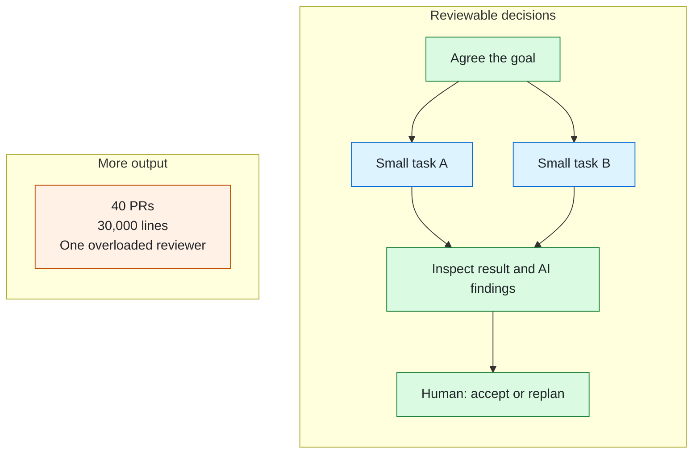

# 1000lines

**Agent speed. Human judgment.**

An agent can hand you thirty thousand lines in forty pull requests. If nobody can
understand the whole, approval becomes a rubber stamp. Producing code got cheaper;
deciding what to build and taking responsibility for it did not.

1000lines turns a rough goal into a reviewable plan, then focused PRs with AI review.
Humans judge the goal, the shape of the work, and its results. When working software
changes our understanding, agents record the decision and replan.

*Illustrative: review the graph before execution, then consider each focused PR and
its AI findings.*

The longer argument, including how much planning is enough and what happens when it
changes: [1000lines](https://github.com/1000lines/.github/blob/main/README.md).

## What's here

- [**symphony**](https://github.com/1000lines/symphony): our fork of
  [openai/symphony](https://github.com/openai/symphony), by way of Orchestra Bio's
  public fork. The orchestrator.
- [**symphony-example**](https://github.com/1000lines/symphony-example): a repository
  wired for agent work, as a worked example from Orchestra Bio.
- **The client template and reusable workflows**: being built for Saturday
  12 September at the [AI Tinkerers hackathon](https://sf.aitinkerers.org/p/agents-everywhere-bots-channels-more-global-hackathon).
  The goal is to connect your repository to the shared service without running your
  own Symphony server.

## If you're at the hackathon

Bring a repo you own. We aim to get agent workflows running in your project and find
out how the planning and review flow works on a codebase that isn't ours.
